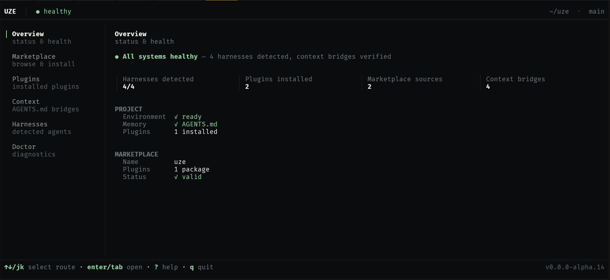

# uze

**Install once. Native everywhere.**

A compatibility layer for agent tooling: install a plugin once, share one
project context, and every harness — Claude, Codex, OpenCode,
Antigravity — gets it through its own most native surface.

  

**[Full documentation →](https://uze-hiukky.vercel.app)**

## Roadmap

- [x] Harness management · Skills & MCP portability · Project context · Marketplace · TUI
- [ ] Agent & hook portability · Native package delivery
- [ ] Requirements & dependencies · Security & trust
- [ ] Runtime context projection · Migration tooling · Ecosystem expansion

---

Built in Rust. Licensed under the Apache License 2.0.
Contributions are welcome under the rules in [CONTRIBUTING.md](CONTRIBUTING.md).

Author: [Romullo Sousa (hiukky)](https://github.com/hiukky) · [Apache License 2.0](LICENSE)

  Built with 🖤 by <a href="https://hiukky.com">Hiukky</a>
   

