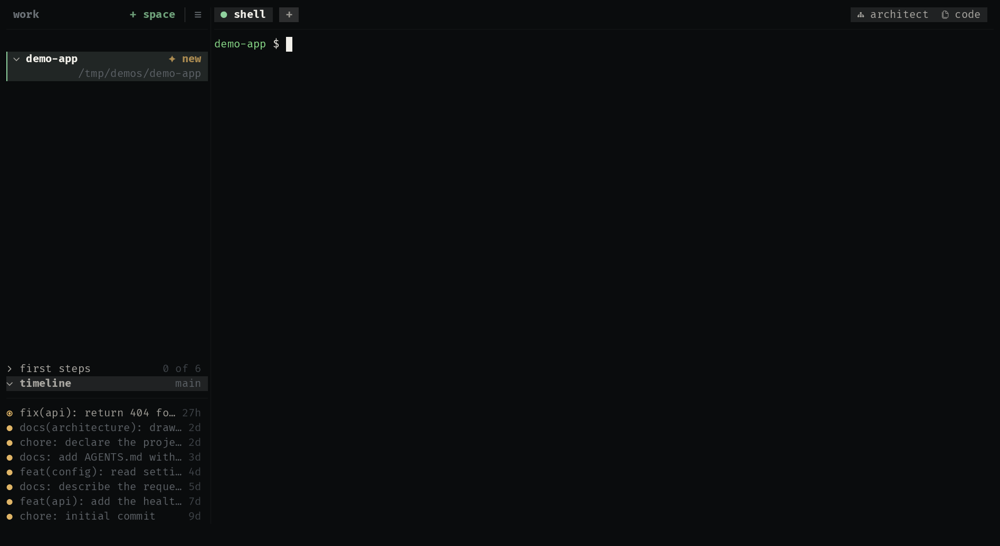

<div align="center">

# uze

**Agents come and go. Your work stays.**

[](https://github.com/uze-sh/uze/actions/workflows/ci.yml)
[](Cargo.toml)
[](LICENSE)
[](https://uze.sh/docs/roadmap)

A compatibility layer for agent tooling: install a plugin once, write one
`AGENTS.md`, and every agent you run gets both through its own most native
surface — Claude Code, Codex, OpenCode and Antigravity today, and whatever
you switch to next. Then run several at once, each in a checkout of its
own or beside you in yours, and close the terminal without losing any of
it.

<p align="center">
  
</p>

```sh
curl -fsSL https://uze.sh/i | sh
```

**[Full documentation →](https://uze.sh/docs)**

</div>

## Roadmap

- [x] Harness management · Skills & MCP portability · Project context · Marketplace · TUI
- [x] Agent & hook portability · Native package delivery
- [x] Profiles · Environment maintenance · Terminal workspace with isolated agents
- [x] Reproducible project environments · Theming · Linux releases · macOS releases (experimental)
- [x] Code & Architect extensions · Plugin freshness · Records that survive an upgrade
- [ ] Requirements & dependencies · Plugin versioning · Security & trust
- [ ] Windows releases · Runtime context projection · Migration tooling · Ecosystem expansion

---

Built in Rust. Licensed under the Apache License 2.0.
Contributions are welcome under the rules in [CONTRIBUTING.md](CONTRIBUTING.md).
Security reports go through [SECURITY.md](SECURITY.md), never a public issue.

**Trademarks.** All product names, logos and brands are the property of their
respective owners. uze names the coding agents it interoperates with for
identification only. It is an independent project and is not affiliated with,
endorsed by, or sponsored by any of them. The marks it ships as artwork, and
the terms each comes under, are credited in [CREDITS.md](CREDITS.md).

Author: [Romullo Sousa (hiukky)](https://github.com/hiukky) · [Apache License 2.0](LICENSE)

<p align="center">
  <sub>Built with 🖤 by <a href="https://hiukky.com">hiukky</a>
  <br/>
</p>
