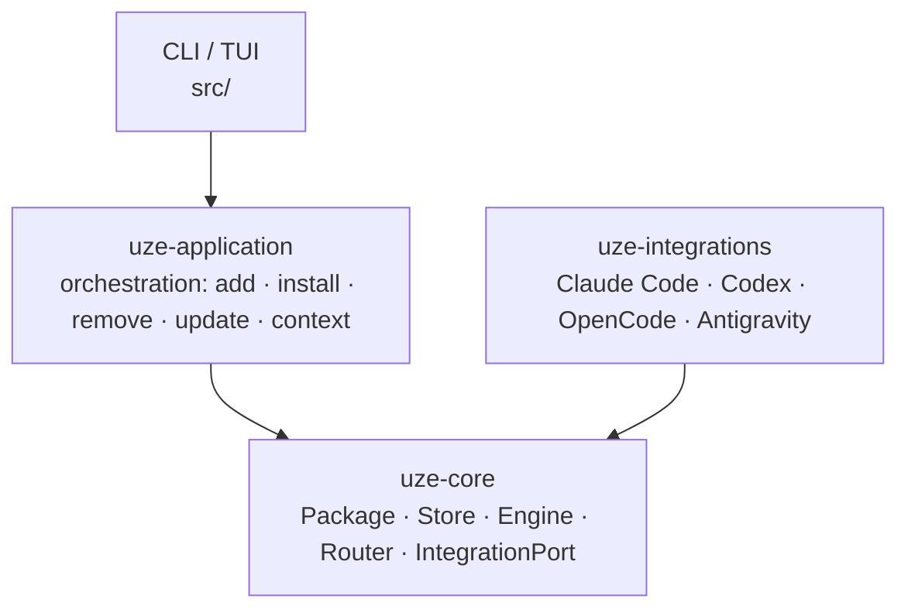

# Architecture

Dependency direction is one-way and enforced by tests, not just convention. Both orchestration and
the vendor adapters depend on the neutral core — never the reverse:

- **`uze-core` never names a harness.** No Claude, Codex, OpenCode, or Antigravity string in
  production code — enforced by `core_never_names_a_vendor_harness`; the same neutrality holds for
  `uze-application` and the CLI/TUI.
- **`uze-integrations` is the only vendor-specific layer.** One module per harness implementing
  the shared `IntegrationPort`; its `registry` is the single composition root. A new harness
  should require no semantic change to Store, Engine, or Router — only a new integration
  vertical, one registry entry, conformance, and docs.
- **Antigravity is the Google-family v0 harness** (ADR-027); the four supported harnesses are the
  current set. Planned: Cursor CLI, Muse, PI.

## Repository layout

<Files>
  <Folder name="crates" defaultOpen>
    <Folder name="uze-core — harness-agnostic domain" />
    <Folder name="uze-application — orchestration" />
    <Folder name="uze-integrations — vendor adapters" />
  </Folder>
  <Folder name="src — CLI, TUI, runtime shim" />
  <Folder name="tests — integration suites (L0–L4)" />
  <Folder name="conformance — Harness Conformance Lab" />
  <Folder name="docs" defaultOpen>
    <Folder name="adr — decision records" />
    <Folder name="architecture — current invariants" />
  </Folder>
  <Folder name="openspec — change proposals" />
  <Folder name="plugins/uze — the official /uze Skill" />
</Files>

## Invariants

`docs/architecture/invariants.md` is the canonical list of "do not break this" behaviors, each
tied to the test that proves it — receipts drive lifecycle safety, the Store is the single source
of truth, derived artifacts are rebuildable, the runtime shim never recurses into itself, every
CLI leaf command is performance-classified.

Design decisions with their rationale live in `docs/adr/`; recent ones cover generated
native-package projection, Skill invocation policy, and portable hooks.