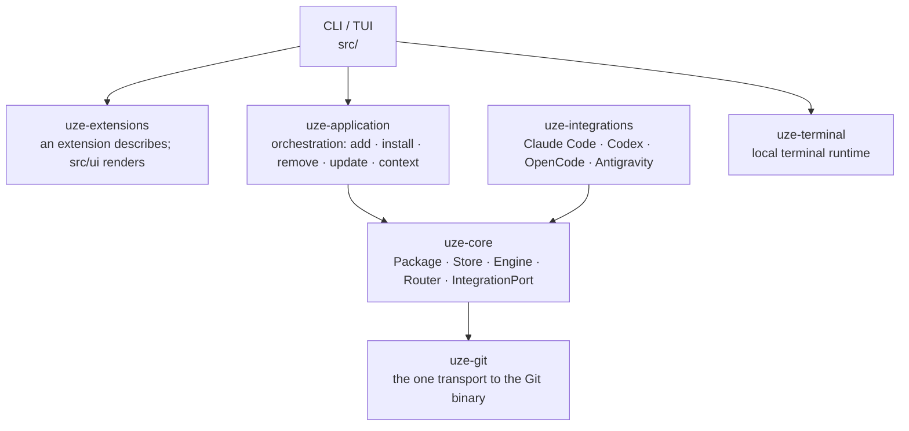

# Architecture

Dependency direction is one-way and enforced by tests, not just convention. Both
orchestration and the vendor adapters depend on the neutral core — never the
reverse:

- **`uze-core` never names a harness.** No Claude, Codex, OpenCode, or Antigravity
  string in production code — enforced by `core_never_names_a_vendor_harness`; the
  same neutrality holds for `uze-application` and the CLI/TUI.
- **`uze-integrations` is the only vendor-specific layer.** One module per harness
  implementing the shared `IntegrationPort`; its `registry` is the single
  composition root. A new harness should require no semantic change to Store,
  Engine, or Router — only a new integration vertical, one registry entry,
  conformance, and docs.
- **Presentation never reaches into the domain.** `src/` may not name `uze_core`
  or `uze_integrations`; it consumes read models from `uze-application`. The debt
  is zero, and the budget is never raised (ADR-042).
- **Antigravity is the Google-family v0 harness** (ADR-027); the four supported
  harnesses are the current set. Planned: Cursor CLI, Muse, PI.

## The supporting crates

- **`uze-git`** — the one transport for speaking to the Git binary: spawn
  convention, `read`/`write` entry points, and Git's exit code reported rather
  than classified. It carries no domain, and nothing else in the workspace spawns
  `git` directly — two callers with two exit-code conventions is exactly what it
  replaced.
- **`uze-terminal`** — the local terminal runtime: a server owning the
  pseudoterminals and a versioned client protocol, so a pane survives the client
  leaving (ADR-038). It depends on nothing else in the workspace.
- **`uze-extensions`** — built-in TUI extensions. An extension answers with a
  view or a section and **never draws**: the host owns rendering, geometry,
  hit-testing and the palette, and every other capability (running Git, reading a
  file, resolving `$HOME`) arrives through a `Host` it is handed. The crate
  depends on no uze crate at all and names no process, filesystem or environment
  API — an extension is code uze runs in its own process, a different trust class
  from plugin bytes a harness reads (ADR-041). The [Git extension](/docs/workspace#the-git-extension)
  is the one built-in today.

## Repository layout

A path and what lives there. The crate boundaries above are the load-bearing
part; everything else is where to look.

| Path | What lives there |
| --- | --- |
| `crates/uze-core` | The harness-agnostic domain: package, store, engine, router, `IntegrationPort` |
| `crates/uze-application` | Orchestration — add, install, remove, update, context |
| `crates/uze-integrations` | The vendor adapters, one module per harness |
| `crates/uze-extensions` | Built-in TUI extensions |
| `crates/uze-terminal` | The local terminal runtime |
| `crates/uze-git` | The one transport to the Git binary |
| `crates/uze-testkit` | Shared test infrastructure |
| `src/` | The CLI, the TUI, and the runtime PATH shim |
| `tests/` | Integration suites, L0–L4 (see `tests/README.md`) |
| `conformance/` | The Harness Conformance Lab |
| `docs/adr/` | Numbered decision records |
| `docs/architecture/` | The invariants that hold today, each tied to its test |
| `openspec/` | Change proposals, active and archived |
| `plugins/uze/` | The official uze plugin |

## Invariants

`docs/architecture/invariants.md` in the repository is the canonical list of "do
not break this" behaviors, each tied to the test that proves it. Among them:

- the Store is the single source of truth and writes nothing a harness reads;
- receipts drive lifecycle safety, and derived artifacts are rebuildable;
- the runtime shim never recurses into itself;
- nothing the workspace client draws waits on a repository — every Git read runs
  on a thread and answers through a channel, and an answer that arrives after the
  viewer moved on is dropped rather than drawn;
- every CLI leaf command is performance-classified.

Design decisions with their rationale live in `docs/adr/`; recent ones cover the
local terminal runtime, portable hooks compiled into the delivered artifact, the
extension trust class, and the architecture seams the test suite enforces.
